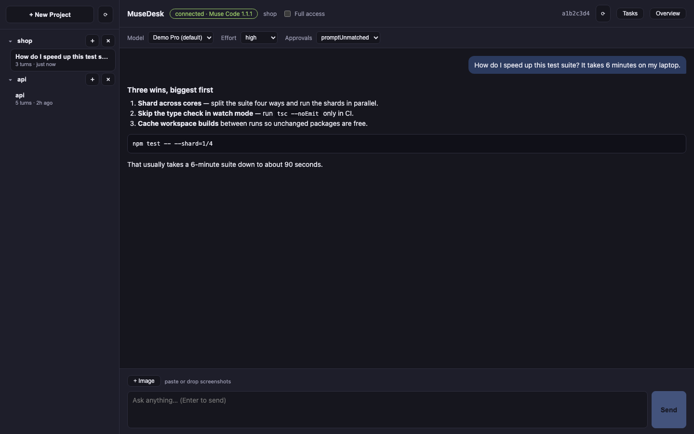
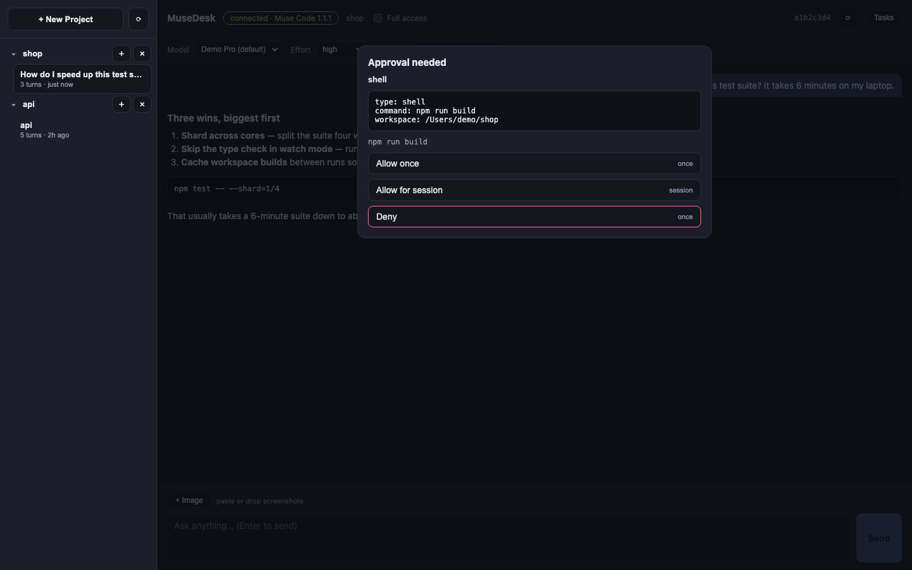

# MuseDesk

> **Unofficial community client — beta.** MuseDesk is not affiliated with or
> endorsed by the makers of Muse Code. It drives the official `muse` CLI that
> you install yourself, under your own membership: the app stores no
> credentials, bundles no binaries, and phones nothing home.

MuseDesk is a macOS desktop client for the official `muse` CLI, speaking its
client-built protocol (MSP over `muse serve` stdio). Chat with streaming
markdown, tool-call visibility, session history shared with the terminal,
screenshot attachments, and model / reasoning-effort / approval controls.

## Screenshots (sample data)





_Screenshots use staged sample data; no real sessions are shown. Regenerate
with `npm run screenshots` (headless, no CLI or auth needed)._

## Requirements

- macOS (the beta packages and tests target macOS; the code is cross-platform).
- The official **Muse Code CLI** installed and on `PATH` (`muse --version`).
  MuseDesk never bundles, downloads, or replaces this binary: without it the
  app shows a clear error and refuses to start a host. Everyone connects with
  their own CLI install and their own membership.
- Node.js 20+ and npm (for development builds).

This build was verified against `Muse Code 1.2.1 (1.2.1-R2847.1)`. On every
launch the app compares the live protocol fingerprint with the pinned one
and refuses to drive an unknown protocol.

## Quick start

```bash
git clone https://github.com/atameric/musedesk.git
cd musedesk
npm install
npm start
```

## Scripts

| Command            | What it does                                              |
| ------------------ | --------------------------------------------------------- |
| `npm start`        | Run the app in development mode                           |
| `npm run package`  | Build a runnable `.app` into `out/`                       |
| `npm run make`     | Build the distributable unsigned `.dmg` into `out/make/`  |
| `npm run typecheck`| `tsc --noEmit`                                            |
| `npm run lint`     | ESLint over TS/TSX (generated `msp.d.ts` excluded)        |
| `npm test`         | Unit tests (hermetic, no CLI needed)                      |
| `npm run e2e`      | E2E: schema-drift gate + scripted fake-host flows + live `muse serve` lifecycle when auth is available |
| `npm run screenshots` | Rebuild the renderer and capture the README screenshots headlessly |

The live lifecycle test needs provider auth (the real host reads the
credential store at startup). Where that is unavailable it skips with a
diagnostic; the scripted suite (`test/helpers/fake-serve.mjs`) covers the
same client paths deterministically with no auth, network, or disk.

## Packaging notes

- `npm run make` must run in a normal terminal: DMG creation needs
  `hdiutil` disk-device access, which sandboxed shells (and CI containers
  without it) cannot provide. The packaged `.app` itself builds anywhere
  via `npm run package`.
- The `package`/`make` scripts preload `scripts/forge-extract-shim.js`
  (see the header comment there): `extract-zip@2` silently aborts the
  Electron-zip extraction on Node 26, so the shim routes that one call
  through the system `unzip`. Same bytes, same layout — remove it once the
  toolchain moves past the incompatibility.

## Chat attachments

Attach screenshots three ways: the **+ Image** button (file picker), pasting
from the clipboard, or dropping files onto the composer. The model receives
the images inline with your prompt and can comment on them.

- Formats: png, jpeg, gif, webp (detected from file contents, not names).
- Limits: up to 5 images per message, 10 MB each.
- Sent images show as thumbnails on your message for the current app run;
  the protocol does not echo image bytes back, so thumbnails don't survive
  an app restart (the model still saw them).

## Working folder

**+ New chat** asks for the working folder every time. The dialog opens at
the last-used folder, so Enter reuses it or pick another one. The sidebar
footer's **+ New chat in X** instead starts immediately in X without asking.
Each session works in one folder, fixed when the session starts. The active
session's folder is shown in the top bar, and your last choice is remembered.

## Full access

The **Full access** checkbox in the top bar disables the shell sandbox for
every session (equivalent to `muse serve --disable-sandbox`). Because the
sandbox posture is fixed per host process, toggling it restarts the
background host and re-attaches your sessions (a second or two; running
turns block the switch). Enabling asks for confirmation first, and the
choice is remembered across launches. Only use it for work you trust.

## Protocol pinning

- `src/msp/msp.d.ts` is the vendored `muse schema generate-ts` export.
  `test/e2e/schema.test.ts` fails if it drifts from the installed binary.
- `src/msp/CLI_VERSION.txt` + `FINGERPRINT.txt` are the sources of truth;
  `pinned.ts` mirrors them (guarded by `test/unit/pinned.test.ts`) and the
  app enforces the fingerprint at connect time.

After a CLI upgrade: re-export the schema, re-pin both files, re-run the
gates, and re-verify the scripted flows.

## Unsigned first launch

The beta ships an unsigned `.dmg` (signed distribution is a later phase).
On first launch macOS may block it:

1. Open the `.dmg` and drag **MuseDesk** to Applications.
2. Right-click (or Control-click) **MuseDesk** → **Open** → **Open** in the dialog.
3. Subsequent launches work normally (a signed release removes this step).

## Security notes

- **No bundled CLI.** The app spawns only the `muse` binary found on `PATH`
  (`src/msp/discovery.ts`). There is no download, update, or vendored-copy
  path by design — supply-chain risk stays with the official installer.
- **Your membership, your machine.** Provider credentials never leave your
  own CLI install: the app talks to a local `muse serve` over stdio and
  stores no keys, tokens, or account data anywhere.
- **Pinned protocol.** Fingerprint mismatch aborts the connection before any
  session command is issued (`src/main.ts`).
- **Renderer isolation.** The UI runs with a preload-only bridge
  (`src/preload.ts`): it can invoke the curated `musedesk:*` IPC set and
  nothing else. No Node integration in the renderer.
- **Markdown is escaped by construction.** `src/shared/markdown.ts` escapes
  all input first, emits only its own tags, and allows `http(s)` link
  targets only (covered by XSS unit tests).
- **Approvals stay human.** Approval dialogs render the server's choices
  verbatim with the race-safe `requirementId` guard; unknown subject kinds
  render generically and are never auto-approved.

## Known limitations (beta)

- Background sessions that request approval/user input show a sidebar badge;
  the dialog opens after switching to that session.
- `session/read` history modes other than `inline`/`snapshot` seed no items;
  live events still stream and a notice is shown.
- No auto-update, no signed build, no Windows/Linux package testing.
- Local session statistics only (no account/credit metering exists client-side).

## License

MIT — see [LICENSE](LICENSE).
